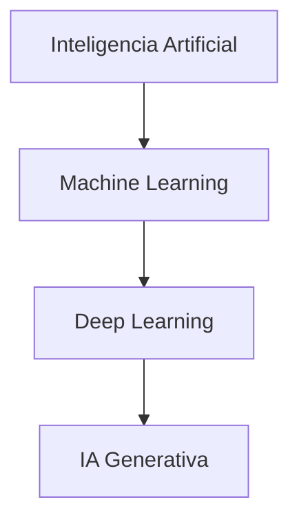

# Deep Learning (Aprendizaje Profundo)

El **Deep Learning (DL)** es un subconjunto del Machine Learning que se basa en redes neuronales artificiales con múltiples capas (de ahí el término "profundo"). Está diseñado para imitar la forma en que el cerebro humano procesa la información, permitiendo a las máquinas resolver problemas extremadamente complejos y trabajar con datos no estructurados.

```Mermaid
graph LR
    %% Definición de la Capa de Entrada
    subgraph Entrada [Capa de Entrada]
        direction TB
        E1((x1))
        E2((x2))
        E3((x3))
    end

    %% Definición de la Capa Oculta
    subgraph Oculta [Capa Oculta]
        direction TB
        H1((h1))
        H2((h2))
        H3((h3))
        H4((h4))
    end

    %% Definición de la Capa de Salida
    subgraph Salida [Capa de Salida]
        direction TB
        S1((y))
    end

    %% Conexiones (Sinapsis)
    E1 --- H1 & H2 & H3 & H4
    E2 --- H1 & H2 & H3 & H4
    E3 --- H1 & H2 & H3 & H4

    H1 & H2 & H3 & H4 --- S1

    %% Estilos
    style E1 fill:#fff,stroke:#333
    style E2 fill:#fff,stroke:#333
    style E3 fill:#fff,stroke:#333

    style H1 fill:#bbf,stroke:#333
    style H2 fill:#bbf,stroke:#333
    style H3 fill:#bbf,stroke:#333
    style H4 fill:#bbf,stroke:#333

    style S1 fill:#f96,stroke:#333
```

## Características Principales

- **Redes Neuronales Multicapa:** Utiliza capas de entrada, capas ocultas y capas de salida para procesar información.

- **Extracción Automática de Características:** A diferencia del ML tradicional, el DL identifica automáticamente las características relevantes de los datos (como bordes en una imagen) sin intervención humana manual.

- **Escalabilidad:** Su rendimiento suele mejorar continuamente a medida que aumenta la cantidad de datos disponibles.

- **Alta Capacidad Computacional:** Requiere hardware potente, como GPUs (Unidades de Procesamiento Gráfico), debido a la complejidad de los cálculos.

## Arquitecturas Comunes

### 1. Redes Neuronales Convolucionales (CNN)

Especializadas en el procesamiento de datos con estructura de cuadrícula, como imágenes.

- **Uso:** Reconocimiento facial, diagnóstico médico por imágenes, vehículos autónomos.

### 2. Redes Neuronales Recurrentes (RNN)

Diseñadas para datos secuenciales donde el orden importa.

- **Uso:** Traducción de idiomas, análisis de sentimientos, predicción de series temporales.

### 3. Transformers

Arquitectura moderna que utiliza mecanismos de "atención" para procesar secuencias de datos de forma paralela. Es la base de los modelos de lenguaje actuales.

- **Uso:** Modelos como GPT, Claude y BERT.

## Diferencias Clave: ML Tradicional vs. Deep Learning

| Característica              | Machine Learning Tradicional                    | Deep Learning                                               |
| :-------------------------- | :---------------------------------------------- | :---------------------------------------------------------- |
| **Datos**                   | Funciona bien con datos estructurados (tablas). | Excelente con datos no estructurados (audio, video, texto). |
| **Intervención Humana**     | Requiere selección manual de características.   | Aprende características automáticamente.                    |
| **Hardware**                | Puede ejecutarse en CPUs estándar.              | Requiere GPUs o TPUs de alto rendimiento.                   |
| **Tiempo de Entrenamiento** | De minutos a horas.                             | De días a semanas.                                          |

## Relación Jerárquica


