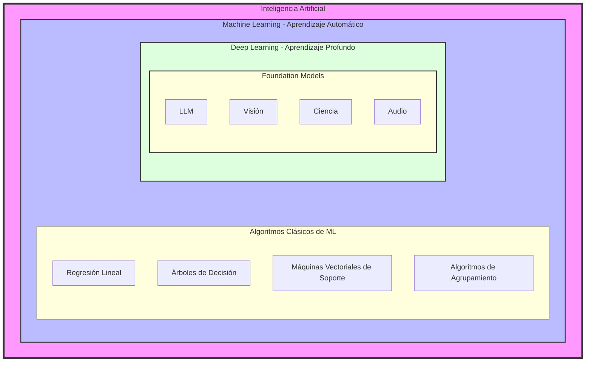

# Diferentes tipos de IA

## Introducción

La inteligencia artificial (IA) engloba una serie de sistemas diseñados para imitar, mejorar o superar las capacidades humanas. La IA puede clasificarse en función de sus capacidades y funcionalidades. Comprender estos tipos y sus capacidades pone de relieve las diversas aplicaciones y el potencial de las tecnologías de IA.

## Objetivos

Tras completar esta lectura, serás capaz de:

- Explicar los tipos de inteligencia artificial en función de sus funcionalidades
- Explorar las capacidades de cada tipo de inteligencia artificial

## Tipos de IA

### IA diagnóstica/descriptiva

La IA diagnóstica o descriptiva se centra en evaluar la corrección del comportamiento mediante el análisis de datos históricos para comprender qué ha ocurrido y por qué. Este tipo de IA es fundamental para identificar patrones y tendencias, realizar análisis comparativos y llevar a cabo análisis de causa raíz.

**Capacidades:**

- Planificación de escenarios: Ayuda a crear diferentes escenarios futuros basándose en datos históricos

- Reconocimiento de patrones y tendencias: Identifica patrones y tendencias recurrentes en conjuntos de datos

- Análisis comparativo: Compara varios puntos de datos para encontrar correlaciones y perspectivas

- Análisis de causas: Determina las razones subyacentes a determinados resultados

## IA predictiva

La IA predictiva se ocupa de predecir resultados futuros basándose en datos históricos y actuales. Este tipo de IA se utiliza ampliamente para predecir el comportamiento de los clientes, las tendencias del mercado y otras perspectivas de futuro.

**Capacidades:**

- Predicción: Predicción de tendencias y acontecimientos futuros

- Agrupación y clasificación: Agrupa puntos de datos similares y los clasifica en categorías predefinidas

- Modelo de propensión: Evalúa la probabilidad de resultados específicos en función de los datos actuales

- Árboles de decisión: Utilizan un modelo de decisiones en forma de árbol para predecir resultados

## IA prescriptiva

La IA prescriptiva se centra en determinar el curso de acción óptimo proporcionando recomendaciones basadas en el análisis de datos. Va más allá de la predicción al sugerir acciones que pueden ayudar a lograr los resultados deseados.

**Capacidades:**

- Personalización: Adapta las recomendaciones y experiencias a las necesidades individuales

- Optimización: Identifica las formas más eficientes de alcanzar los ob jetivos

- Prevención del fraude: Detecta y previene actividades fraudulentas mediante análisis

- Recomendación de la siguiente mejor acción: Proporciona información práctica sobre los siguientes pasos a seguir

## IA generativa/cognitiva

La IA generativa o cognitiva interviene en la producción de diversos tipos de contenidos, como código, artículos, imágenes, etc. Este tipo de IA imita la creatividad humana y los procesos cognitivos para automatizar y ayudar en la creación de contenidos.

**Capacidades:**

- Asesora: Ofrece consejos y recomendaciones de expertos

- Crea: Produce nuevos contenidos, como texto, imágenes y código

- Protege: Mejora las medidas de seguridad mediante análisis inteligentes

- Asiste: Proporciona asistencia en diversas tareas, mejorando la eficiencia

- Automatiza: Automatiza las tareas repetitivas para ahorrar tiempo y recursos

## IA reactiva

Los sistemas de IA reactiva están diseñados para responder a entradas específicas con respuestas predeterminadas. No tienen memoria ni la capacidad de aprender de experiencias pasadas, por lo que son adecuados para tareas que requieren reacciones inmediatas.

**Capacidades:**

- Acciones basadas en reglas: Ejecuta acciones específicas basadas en reglas predefinidas

- Respuestas instantáneas: Proporciona respuestas inmediatas a las entradas

- Análisis estático de datos: Analiza los datos actuales sin tener en cuenta las interacciones pasadas

## IA de memoria limitada

Los sistemas de IA de memoria limitada tienen la capacidad de utilizar experiencias pasadas para fundamentar las decisiones actuales. Pueden aprender de los datos históricos para mejorar su rendimiento a lo largo del tiempo. Este tipo de IA se utiliza habitualmente en vehículos autónomos y sistemas de recomendación.

**Capacidades:**

- Aprender de los datos: Utiliza datos históricos para tomar decisiones informadas

- Reconocimiento de patrones: Identifica patrones a lo largo del tiempo para mejorar la precisión

- Respuestas adaptativas: Adapta las respuestas en función de interacciones anteriores

## Inteligencia Artificial basada en la Teoría de la Mente

La IA basada en la teoría de la mente es un tipo avanzado de IA cuyo objetivo es comprender las emociones, creencias e intenciones humanas. Aún se encuentra en fase de investigación y pretende interactuar de forma más natural con los seres humanos mediante la comprensión de sus estados mentales.

**Capacidades:**

- Reconocimiento de emociones: Identifica las emociones humanas y responde a ellas

- Interacción social: Participa en interacciones más naturales y similares a las humanas

- Predicción de intenciones: Predice las intenciones humanas basándose en el contexto y el comportamiento

## IA autoconsciente

La IA autoconsciente representa la forma más avanzada de IA, que tiene su propia conciencia y autoconciencia. Este tipo de IA puede comprender sus propias emociones y estados y reaccionar ante ellos. Sigue siendo un concepto teórico y aún no se ha hecho realidad.

**Capacidades:**

- Autodiagnóstico: Evalúa su propio rendimiento y salud

- Aprendizaje autónomo: Aprende de forma independiente sin intervención humana

- Comportamiento adaptativo: Ajusta su comportamiento en función de su autoconocimiento

## IA estrecha (IA débil)

La IA estrecha está diseñada para realizar una tarea específica o una gama limitada de tareas. Destaca en un área concreta, pero carece de capacidad de generalización. La mayoría de las aplicaciones actuales de IA entran en esta categoría.

**Capacidades:**

- Especialización en tareas: Destaca en la realización de tareas específicas

- Alta precisión: Alcanza un alto rendimiento en el área designada

- Eficacia: Funciona eficazmente dentro de su ámbito de Especialización

## IA general (IA fuerte)

La IA general, al igual que la inteligencia humana, puede comprender, aprender y aplicar conocimientos en una amplia gama de tareas. También puede transferir conocimientos de un dominio a otro y adaptarse a nuevas situaciones de forma autónoma.

**Capacidades:**

- Aprendizaje transversal: Aplica conocimientos en varios ámbitos

- Toma de decisiones autónoma: Toma decisiones de forma autónoma en diversos escenarios

Comprensión similar a la humana: Comprende y procesa la información de forma similar a los humanos

## Resumen

En esta lectura, ha aprendido lo siguiente:

- IA diagnóstica/descriptiva: se centra en evaluar la corrección del comportamiento mediante el análisis de datos históricos para comprender qué ha ocurrido y por qué

- IA predictiva: se ocupa de predecir resultados futuros basándose en datos históricos y actuales

- IA prescriptiva: se centra en determinar el curso de acción óptimo proporcionando recomendaciones basadas en el análisis de datos

- IA generativa/cognitiva: participa en la producción de diversos tipos de contenido, como código, artículos, imágenes, etc

- IA reactiva: diseñada para responder a entradas específicas con respuestas predeterminadas

- IA con memoria limitada: utiliza experiencias pasadas para tomar decisiones en el presente

- IA con teoría de la mente: pretende comprender las emociones, creencias e intenciones humanas

- IA autoconsciente: representa una forma avanzada de IA con autoconciencia (teórica)

- IA estrecha (IA débil): Diseñada para realizar tareas específicas

- IA general (IA fuerte): Puede realizar una amplia gama de tareas similares a la inteligencia humana

## Clasificación de IA

- IA débil(Narrow IA/Weak IA): Es el tipo de inteligencia artificial que existe hoy en día. Está diseñada y entrenada para realizar una tarea específica (como el reconocimiento facial, traducir textos o jugar ajedrez). Aunque puede superar al ser humano en su función particular, carece de conciencia, autoconciencia o la capacidad de aplicar su conocimiento a un área diferente para la que fue programada.

- IA general(Wide IA/Strong IA): Representa un nivel hipotético de IA en el que la máquina posee la capacidad de comprender, aprender y aplicar inteligencia de manera similar a un ser humano. Una AGI podría razonar, resolver problemas en dominios desconocidos, tener conciencia de sí misma y pasar el Test de Turing de forma indistinguible. Actualmente, es el gran objetivo de la industria pero aún no se ha alcanzado.

- IA superinteligente(Superintelligent AI): Es una etapa teórica que va más allá de la capacidad humana. Se define como una inteligencia que supera con creces el rendimiento cognitivo de los seres humanos en prácticamente todos los campos, incluyendo la creatividad científica, la sabiduría general y las habilidades sociales. Se asocia frecuentemente con el concepto de "Singularidad Tecnológica", donde el crecimiento tecnológico se vuelve incontrolable.

> [!NOTE]
> La transición de la IA débil a la AGI es el foco actual de investigación en modelos de lenguaje avanzados (como Claude o GPT), que aunque muestran destellos de generalización, siguen operando bajo arquitecturas de propósito específico.

## Relación de IA

