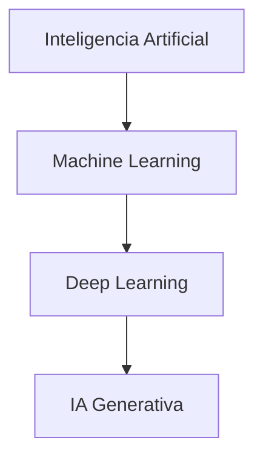

# Generative AI (IA Generativa)

La **Inteligencia Artificial Generativa** es una rama de la IA que se especializa en crear contenido nuevo a partir de patrones aprendidos en datos existentes. En lugar de solo tomar decisiones o clasificar información, los modelos generativos pueden producir texto, imágenes, audio, video y código.

## ¿Qué es la IA Generativa?

- **Genera contenido original:** crea nuevas muestras que no estaban presentes en el conjunto de entrenamiento.

- **Aprende distribuciones de datos:** modela la forma en que los datos reales se distribuyen y usa ese conocimiento para generar ejemplos similares.

- **Usa redes neuronales avanzadas:** es un campo estrechamente relacionado con Deep Learning, especialmente con arquitecturas modernas como Transformers.

## Características principales

- **Creatividad asistida por máquina:** permite escribir textos, diseñar imágenes, generar música o proponer frases nuevas.

- **Adaptación al contexto:** puede responder según instrucciones, estilos o ejemplos previos.

- **Versatilidad multimodal:** algunos modelos generan más de un tipo de contenido (texto + imagen, audio + texto, etc.).

- **Dependencia de datos grandes:** su calidad mejora significativamente con la cantidad y diversidad de datos usados en el entrenamiento.

## Arquitecturas clave de IA Generativa

### 1. Transformers

Los **Transformers** son la base de muchos modelos generativos actuales. Usan mecanismos de atención para relacionar todos los elementos de una secuencia y generar contenido coherente.

- **Uso:** GPT, BERT, T5, CLIP, DALL·E.
- **Fortaleza:** procesan secuencias largas y aprenden dependencias contextuales sin necesidad de estructuras recurrentes.

### 2. Modelos Autoregresivos

Los modelos autoregresivos generan una secuencia elemento por elemento.

- **Cómo funciona:** predicen el siguiente token con base en los tokens anteriores.

- **Ejemplos:** GPT-3, GPT-4, algunos modelos de texto a imagen.

### 3. Modelos Difusivos

Los **modelos de difusión** crean contenido a partir de ruido gradual.

- **Proceso:** convierten ruido aleatorio en datos estructurados mediante pasos de denoising.

- **Uso:** generación de imágenes realistas y audio.

### 4. Variational Autoencoders (VAE) y Generative Adversarial Networks (GAN)

Aunque menos populares en las aplicaciones de lenguaje, estas arquitecturas también son parte del historial de IA generativa.

- **VAE:** aprenden una representación latente continua y generan muestras plausibles.

- **GAN:** enfrentan dos redes (generador y discriminador) para mejorar la calidad de los datos sintéticos.

```Mermaid
graph LR
    %% Bloque de Datos Reales
    subgraph Real [Datos Reales]
        DS[(Dataset)] --> RS[Real Sample]
    end

    %% Bloque Generativo
    subgraph Generativo [Red Generativa]
        Noise[Latent Noise] --> GEN{Generator}
        GEN --> FS[Fake Sample]
    end

    %% Bloque Adversario (El Juez)
    subgraph Clasificador [Red Adversaria]
        DIS((Discriminator))
    end

    %% Conexiones al Discriminador
    RS --> DIS
    FS --> DIS

    %% Resultados del Discriminador
    DIS --> Real_Out[Verdict: REAL]
    DIS --> Fake_Out[Verdict: FAKE]

    %% Estilos
    style DS fill:#f9f,stroke:#333
    style GEN fill:#bbf,stroke:#333
    style DIS fill:#f96,stroke:#333
    style RS fill:#dfd,stroke:#333
    style FS fill:#fdd,stroke:#333
```

## Relación con Machine Learning y Deep Learning

- La **IA Generativa** es un subconjunto de **Deep Learning**.

- El **Deep Learning** es un subconjunto de **Machine Learning**.

- El **Machine Learning** es un subconjunto de la **Inteligencia Artificial**.



## Diferencias clave frente a ML tradicional

- **Salida:** ML tradicional predice etiquetas o valores; IA Generativa crea contenido nuevo.

- **Entradas:** ML supervisado usa datos etiquetados; IA Generativa aprende estructuras internas de los datos.

- **Objetivo:** ML clasifica o estima; IA Generativa sintetiza y propone.

## Ciclo de vida de un proyecto de IA Generativa

1. **Recolección de datos:** recopilar textos, imágenes, audio o combinaciones multimodales.

2. **Preprocesamiento:** limpiar, normalizar y tokenizar los datos.

3. **Entrenamiento:** ajustar el modelo para que capture la distribución de los datos.

4. **Evaluación:** medir coherencia, diversidad y fidelidad del contenido generado.

5. **Afinado:** usar aprendizaje por refuerzo, ajuste fino o técnicas de alineación para mejorar la calidad.

6. **Despliegue:** integrar el modelo en aplicaciones, asistentes, herramientas creativas o sistemas de generación automática.

## Casos de uso comunes

- **Generación de texto:** redacción automática, resúmenes, respuestas en chatbots.

- **Imágenes sintéticas:** creación de arte digital, diseño gráfico, prototipado rápido.

- **Audio y música:** composición musical, doblaje, conversión de texto a voz.

- **Código:** autocompletado, generación de scripts y asistencia de programación.

- **Contenido multimodal:** transformar texto en imagen o video, generar subtítulos automáticos.

## Buenas prácticas y consideraciones

- **Calidad de los datos:** igual que en ML, la calidad del entrenamiento impacta directamente en los resultados.

- **Ética y sesgos:** revisar si el modelo reproduce estereotipos o información dañina.

- **Validación humana:** los resultados generados deben evaluarse con criterio para garantizar utilidad y coherencia.

- **Transparencia:** conocer las limitaciones del modelo y explicar cuándo se usa contenido generado automáticamente.

## Ejemplos de herramientas y modelos

- **GPT:** enfoque en texto y conversaciones.

- **DALL·E / Stable Diffusion:** generación de imágenes a partir de texto.

- **Whisper:** transcripción y generación de audio.

- **Claude / Bard:** asistentes de IA avanzados con capacidad generativa.

## Conclusión

La IA Generativa combina técnicas de Deep Learning con nuevos enfoques de creatividad computacional. Su impacto se ve en la automatización de tareas creativas, la generación de contenidos personalizados y la creación de nuevas formas de interacción humano-computadora.

> [!TIP]
> En IA Generativa, la mejor combinación es un modelo potente con datos relevantes y una supervisión responsable durante el uso.
