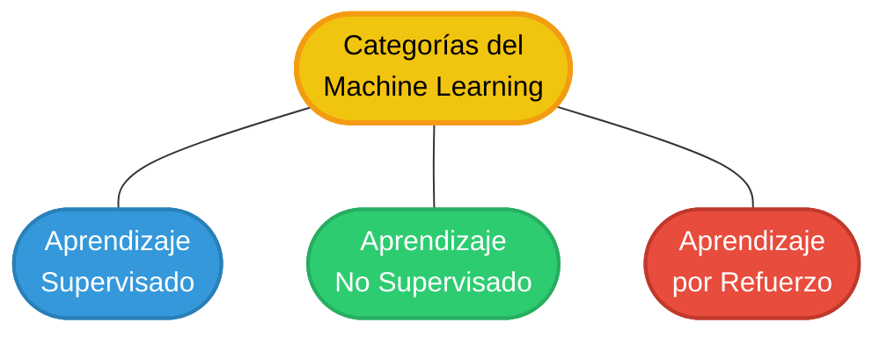
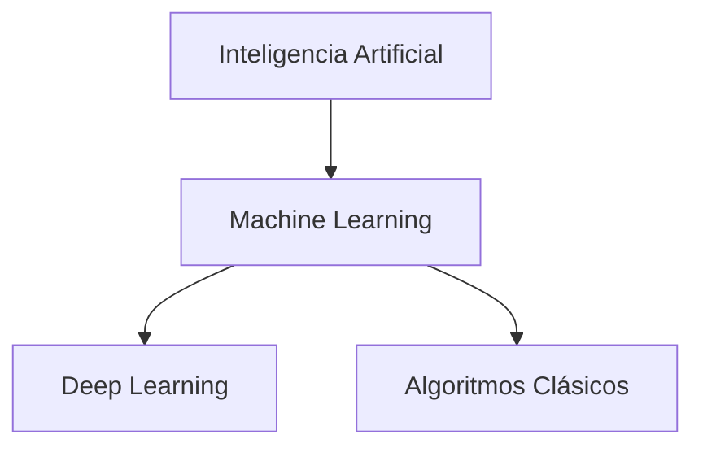

# Machine Learning (Aprendizaje Automático)

El **Machine Learning (ML)** es una rama de la Inteligencia Artificial que se centra en el desarrollo de algoritmos y modelos estadísticos que permiten a las computadoras aprender de los datos y realizar tareas sin ser programadas explícitamente para cada una de ellas. En lugar de seguir instrucciones rígidas, el sistema identifica patrones en los datos para tomar decisiones o realizar predicciones.

## Características Principales

- **Aprendizaje a partir de datos:** Mejora su rendimiento a medida que se le proporcionan más ejemplos.

- **Automatización:** Capacidad de procesar grandes volúmenes de información y extraer conclusiones de forma autónoma.

- **Generalización:** Capacidad de aplicar lo aprendido a datos nuevos que el modelo nunca ha visto antes.

- **Iterativo:** El proceso de entrenamiento implica ajustar parámetros repetidamente para minimizar el error.

## Tipos de Machine Learning

### 1. Aprendizaje Supervisado (Supervised Learning)

El modelo se entrena con un conjunto de datos etiquetados (datos que ya tienen la respuesta correcta).

- **Uso:** Clasificación de correos (Spam vs. No Spam), predicción de precios de viviendas.
- **Algoritmos comunes:** Regresión lineal, Árboles de decisión, SVM.

### 2. Aprendizaje No Supervisado (Unsupervised Learning)

El modelo trabaja con datos que no tienen etiquetas. Su objetivo es encontrar estructuras o patrones ocultos.

- **Uso:** Segmentación de clientes, compresión de imágenes, detección de anomalías.
- **Algoritmos comunes:** K-Means (Clustering), PCA (Análisis de Componentes Principales).

### 3. Aprendizaje por Refuerzo (Reinforcement Learning)

El agente aprende a través de la interacción con un entorno, recibiendo recompensas por acciones correctas y penalizaciones por las incorrectas.

- **Uso:** Robótica, videojuegos, optimización de rutas logísticas.

## Ciclo de Vida de un Proyecto de ML

1. **Recopilación de datos:** Obtener información relevante.
2. **Preparación/Limpieza:** Manejar datos faltantes, ruidos y normalización.
3. **Selección del modelo:** Elegir el algoritmo adecuado según el problema.
4. **Entrenamiento:** Alimentar al modelo con datos para que aprenda.
5. **Evaluación:** Probar el modelo con datos nuevos para medir su precisión.
6. **Despliegue:** Implementar el modelo en un entorno de producción.

## Casos de Uso Comunes

- **Reconocimiento de voz:** Asistentes virtuales como Siri o Alexa.

- **Sistemas de recomendación:** Sugerencias de Netflix, Amazon o Spotify.

- **Visión artificial:** Reconocimiento facial y diagnóstico médico por imágenes.

- **Finanzas:** Detección de fraudes bancarios y análisis de riesgos crediticios.

## Diferencia entre ML y Deep Learning

Aunque a menudo se confunden, el **Deep Learning** es un subconjunto del Machine Learning que utiliza redes neuronales artificiales con múltiples capas para procesar datos de alta complejidad (como audio o video), mientras que el ML tradicional suele trabajar con datos más estructurados y requiere más intervención humana para la selección de características.

## Relación Jerárquica

> [!TIP]
> El éxito de un modelo de Machine Learning depende más de la **calidad de los datos** que de la complejidad del algoritmo utilizado.
