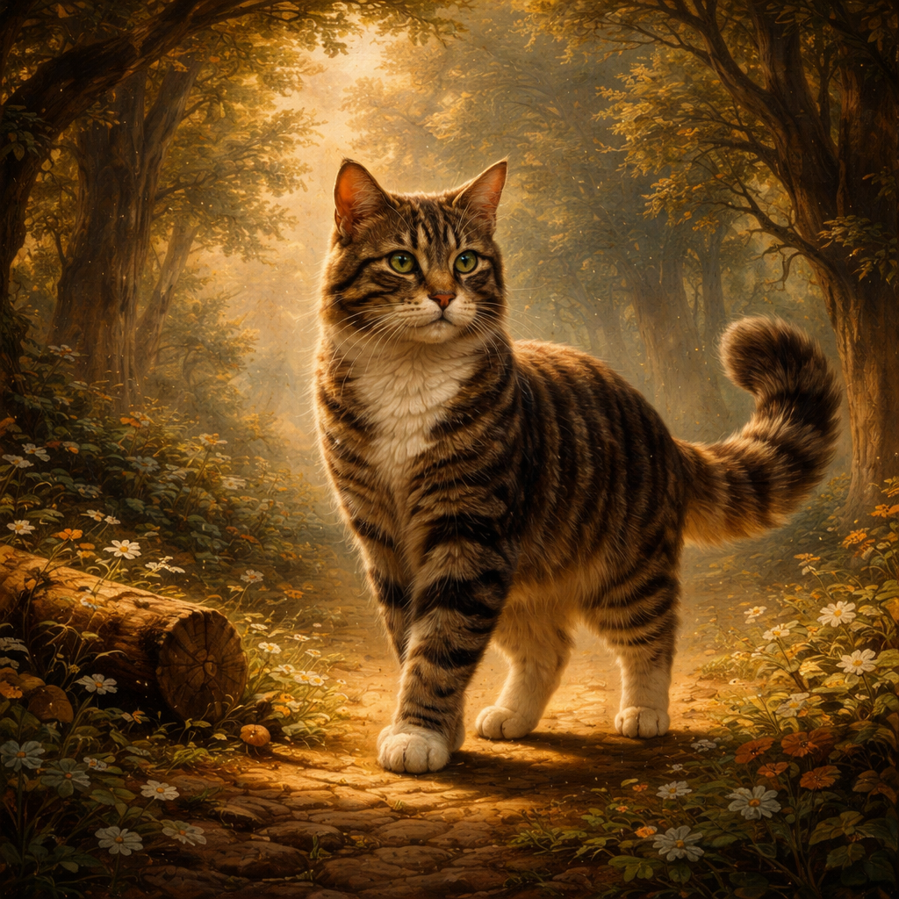

# Prompt Engineer

La **Ingeniería de Instrucciones (Prompt Engineering)** es el proceso de diseñar, refinar y optimizar las entradas (prompts) para guiar a los modelos de IA generativa, como los LLM, hacia la producción de resultados precisos, relevantes y de alta calidad.

## ¿Qué es un Prompt?

Un **prompt** es cualquier forma de entrada (texto, imagen, código) que se proporciona a un modelo de IA para solicitar una respuesta. La calidad de la salida depende directamente de la claridad y estructura de esta instrucción.

## Elementos de un Prompt Efectivo

Para obtener resultados óptimos, un prompt suele incluir:

1. **Instrucción:** La tarea específica que se desea que el modelo realice.
2. **Contexto:** Información de fondo que ayuda al modelo a situarse.
3. **Datos de entrada:** La información que el modelo debe procesar.
4. **Indicadores de salida:** El formato o estilo deseado para la respuesta (JSON, tabla, lista, tono formal, etc.).

## Técnicas Comunes

- **Zero-shot Prompting:** Pedir al modelo que realice una tarea sin darle ejemplos previos.

- **Few-shot Prompting:** Proporcionar algunos ejemplos de entrada-salida para que el modelo aprenda el patrón.

- **Chain-of-Thought (Cadena de pensamiento):** Indicar al modelo que "piense paso a paso" para resolver problemas lógicos complejos.

- **Role Prompting:** Asignar un rol específico al modelo (ej. "Actúa como un experto en ciberseguridad").

- **Interview Pattern(Patron de Entrevista):** Hacer preguntas específicas para obtener información detallada o estructurada.

- **Tree-of-Thought (Árbol de Pensamiento):** Explorar múltiples caminos de razonamiento de forma paralela para resolver problemas complejos.

- **The playoff Method(Método del desempate):** Generar múltiples respuestas y luego seleccionar la mejor utilizando un proceso de evaluación adicional.

## Técnicas Comunes en la creación de Imagenes

- **Styes Modifiers:** Palabras clave que definen el estilo artístico (ej. "Cyberpunk", "Impressionist", "Minimalist").

  graph LR
  %% Definición de Estilos Básicos (Formas y Bordes)
  classDef default fill:#FFFFFF,stroke:#333333,stroke-width:2px,font-family:Arial,font-weight:bold;
  classDef centerNode fill:#FFFFFF,stroke:#000000,stroke-width:3px,font-family:Arial,font-weight:bold,font-size:16px;

  %% Nodos Específicos con sus Colores de Borde Originales
  VE((Visual elements)):::centerNode
  C((Color)):::default
  CO((Contrast)):::default
  TE((Texture)):::default
  SH((Shape)):::default
  SI((Size)):::default

  %% Estilos de Color Personalizados para los Bordes (Simulando la imagen)
  style C stroke:#8A46FF,stroke-width:4px;
  style CO stroke:#E6397B,stroke-width:4px;
  style TE stroke:#009BB0,stroke-width:4px;
  style SH stroke:#0071CE,stroke-width:4px;
  style SI stroke:#008A7B,stroke-width:4px;

  %% Conexiones del Diagrama
  VE --- C
  VE --- CO
  VE --- TE
  VE --- SH
  VE --- SI

**Ejemplos:**

- Un hombre corriendo por el parque, encantador, ilustración acogedora en acuarela sobre un fondo gris

- Una vaca grande y gorda en medio de un mercado antiguo, (dibujo de manuscrito medieval)

- Un paisaje de ensueño y surrealista, colores pastel, con alto contraste

---

- **Quality booster:**Términos que mejoran la definición y el detalle visual (ej. "High resolution", "8k", "Highly detailed", "Masterpiece").

graph LR
%% Definición de estilos generales (Nodos rectangulares con flecha implícita)
classDef step fill:#8A46FF,stroke:#8A46FF,color:#FFFFFF,font-family:Arial,font-weight:bold,font-size:14px;

    %% Nodos del Flujo de Calidad
    NR(Noise reduction   - Reducción de ruido -):::step
    S(Sharpening   - Enfoque / Nitidez -):::step
    CC(Colour correction   - Corrección de color -):::step
    RE(Resolution enhancement   - Mejora de resolución -):::step

    %% Conexiones secuenciales
    NR --> S
    S --> CC
    CC --> RE

**Ejemplos:**

- Genera una imagen de primer plano que resalte la textura de la corteza de un árbol con resolución 4k.

- Crea un retrato humano con detalles nítidos y definidos y líneas finas.

- Crea una imagen de un fuerte alto y gigantesco con colores complementarios y un fondo borroso para que el sujeto destaque.

---

- **Repetition:** Incluir términos que refuercen la importancia de ciertos elementos o características (ej. "Highly detailed", "Intricate details", "Extremely realistic").

**Ejemplos:**

Aquí tienes las traducciones directas y limpias de los tres ejemplos basados en la técnica de repetición de la última imagen (image_8ae293.jpg):

- Una diminuta, diminuta, diminuta, diminuta, diminuta, diminuta, diminuta, diminuta, diminuta cabaña acogedora en el corazón del denso, denso, denso, denso, denso, denso, denso, denso, denso, denso bosque.

- Un enorme, enorme, enorme, enorme, enorme, enorme, enorme, enorme, enorme y magnífico castillo posado en una colina con vistas al vasto, vasto, vasto, vasto, vasto, vasto mar.

- Un sereno, sereno, sereno, sereno, sereno, sereno, sereno, sereno, sereno, sereno lago de montaña que refleja el claro, claro, claro, claro, claro, claro, claro, claro cielo y el exuberante, exuberante, exuberante, exuberante, exuberante, exuberante, exuberante, exuberante, exuberante bosque verde de los alrededores.

---

- **Weighted terms:** Asignar pesos a ciertos términos para enfatizar o de-emfatizar su importancia en la generación (ej. "A cat:1.5", "A dog:0.5").

**Ejemplos:**

- Crea una imagen de una sala de estar acogedora con una chimenea cálida: 10 y crujiente: 8.

- Genera un paisaje urbano vibrante con rascacielos resplandecientes: 6 e iluminados con neón: 8.

- Representa un mercado callejero bullicioso con puestos de comida coloridos: -6 y exóticos: 10.

---

-- **Fix deformed generation:** Instrucciones para corregir deformaciones o errores comunes en la generación de imágenes (ej. "Fix deformed hands", "Correct facial features", "Remove artifacts").

**Ejemplos:**

- Madre Teresa con mano saludando [manos desfiguradas, deforma, manos distorsionadas, dedos distorsionados, mala anatomía, malas manos].

- Una niña pequeña sonriendo: [mala, fea, cuerpo deformado, rostro distorsionado, bizca, borrosa].

- Un hombre corriendo en una caminadora: [malas piernas, cuerpo desfigurado, mala anatomía, photoshopeado].

---

- **Lighting and Rendering:** Instrucciones sobre la iluminación y el acabado técnico (ej. "Volumetric lighting", "Unreal Engine 5", "Ray tracing").

- **Composition:** Términos que dictan el encuadre y la perspectiva (ej. "Wide shot", "Bird's eye view", "Macro photography").

- **Negative Prompts:** Especificar lo que NO se desea que aparezca en la imagen para filtrar elementos no deseados.

## Importancia en la IA Generativa

La ingeniería de instrucciones actúa como un puente entre la intención humana y la ejecución de la máquina. Permite:

- Reducir alucinaciones (respuestas falsas).
- Ahorrar costos de computación al obtener la respuesta correcta al primer intento.
- Personalizar la experiencia del usuario sin necesidad de reentrenar el modelo.

> [!IMPORTANT]
> Un buen ingeniero de prompts no solo sabe escribir, sino que entiende cómo el modelo procesa la información y aplica un enfoque iterativo de prueba y error.

## Lab Generar imagen a partir de un texto 

Prompt: quiero la imagen de un gato atigrado[orejas, patas, cola] en un bosque iluminado en alta definicion estilo barroco

Módelo: GPT Image 1.5 

Resultado 

