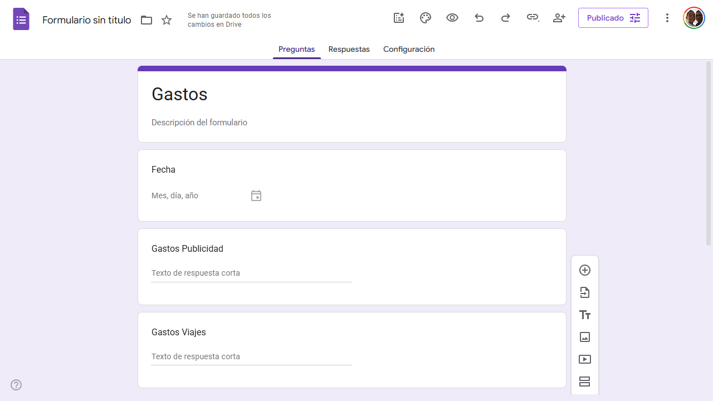
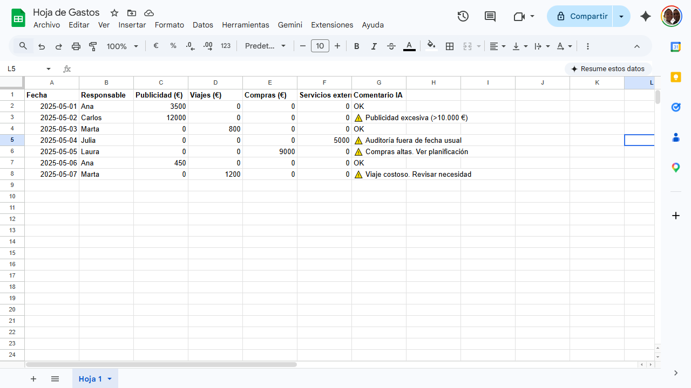
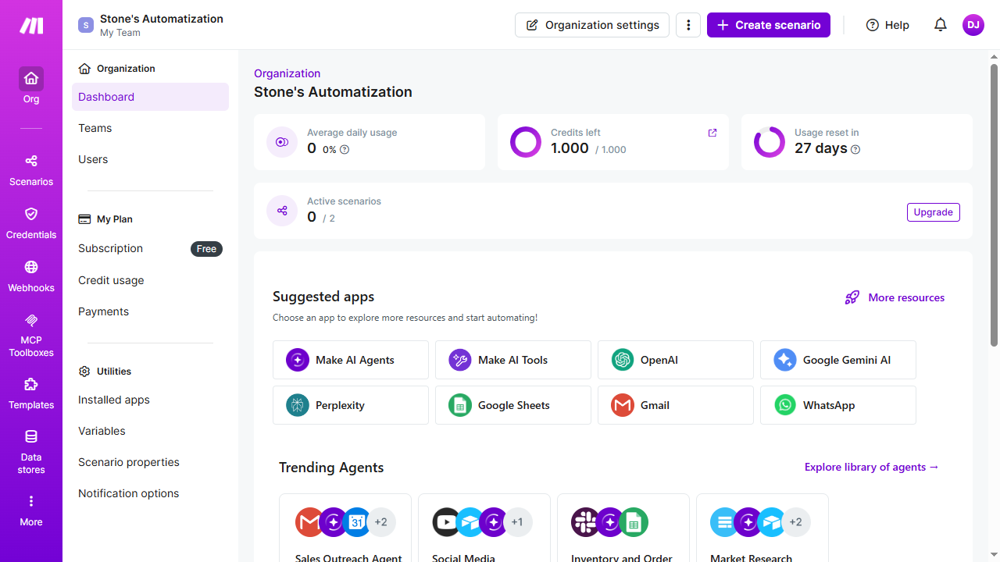
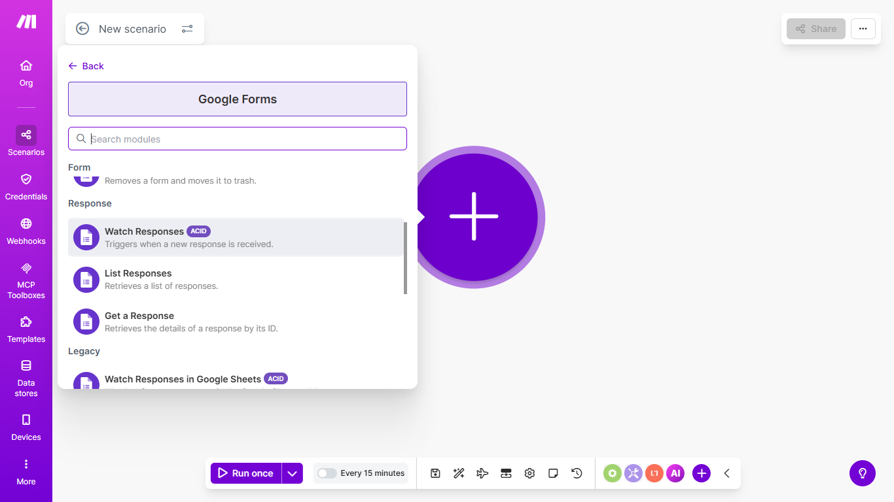
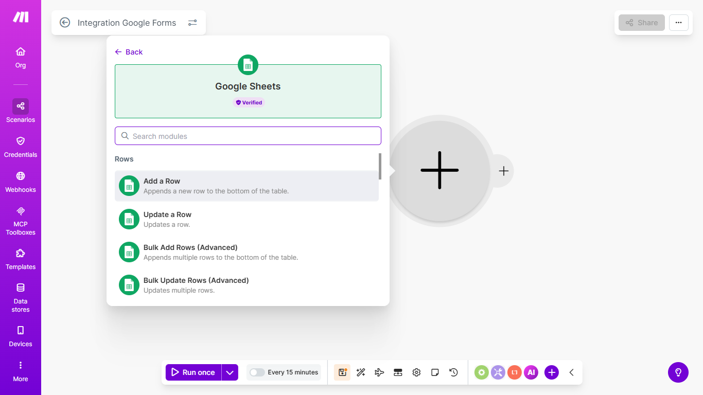
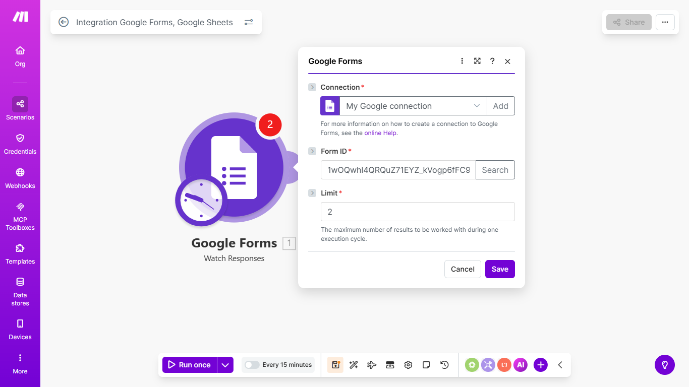
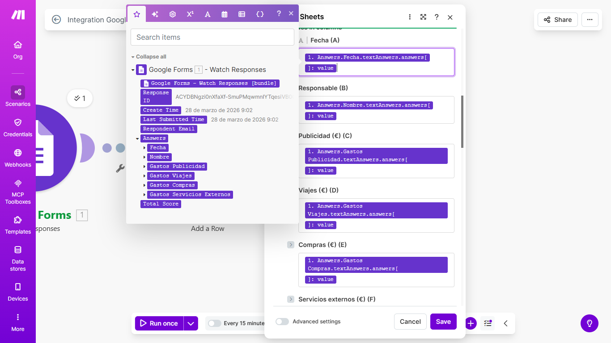
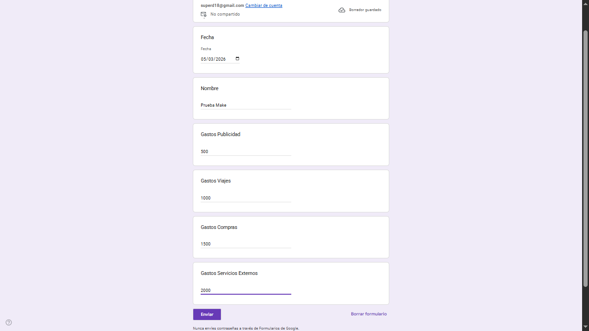
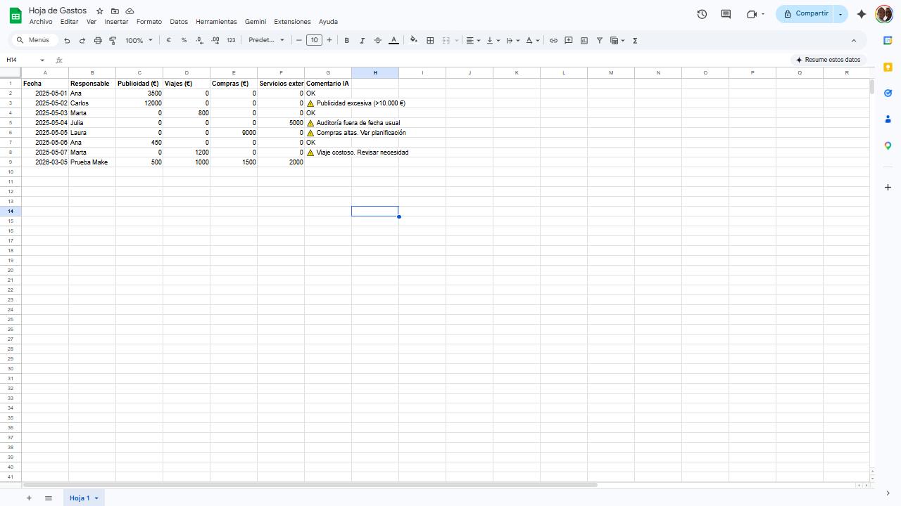

# Primer ejercicio

En este ejercicio se usará Make para tomar los datos de un Formulario de Google y pasarlos a un Google Sheet.

**Vista del formulario:**

**Vista de Google Sheet:**

1. En el navegador se accede a Make y se selecciona la opción de Create scenario.

2. En la siguiente pantalla se pueden seleccionar las aplicaciones a usar; en este caso se selecciona Google Forms y en las opciones Watch Responses.

> [!NOTE]
> A diferencia de Zapier, Make no muestra las opciones separando los disparadores de las acciones, sino que están todas en la misma lista.

3. Se continuará agregando otro módulo al escenario para conectarse con Google Sheet y la opción Add Row, que es el planteamiento del ejercicio.

4. Luego se procede a configurar el módulo de Google Forms; para esto se debe vincular la cuenta que tiene el formulario creado y asignarle los permisos pertinentes como se ve a continuación.

- Se hace clic en Create a connection.
- En la nueva ventana se selecciona Sign in with Google.
- Se busca el formulario por el nombre o se copia el ID del mismo, que es el código que aparece en la URL del documento.
- Se mostrará una ventana donde se debe especificar desde cuándo tomar los cambios; se selecciona `From now on`.

5. Se repiten los pasos para el módulo de Google Sheets.

> [!IMPORTANT]
> La forma más sencilla de vincular los campos al Sheet es llenar un formulario completo, en la pantalla del escenario presionar `Run once` y así se podrá seleccionar el valor del campo del formulario.

6. Por último, se procede a guardar y activar el escenario.

- Se procede a llenar y enviar el formulario.

- Se revisa que la información se cargó en el Google Sheet (puede tardar hasta 15 minutos).

Y ya se tiene el primer escenario listo. Felicitaciones.
