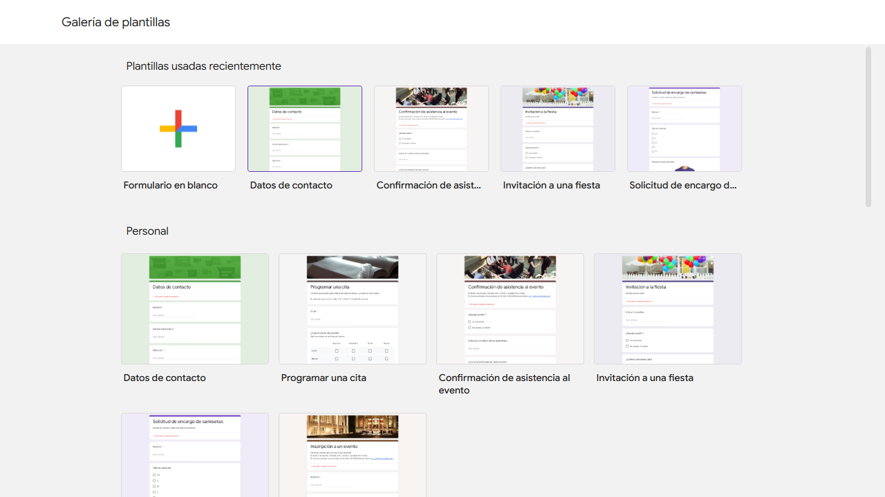
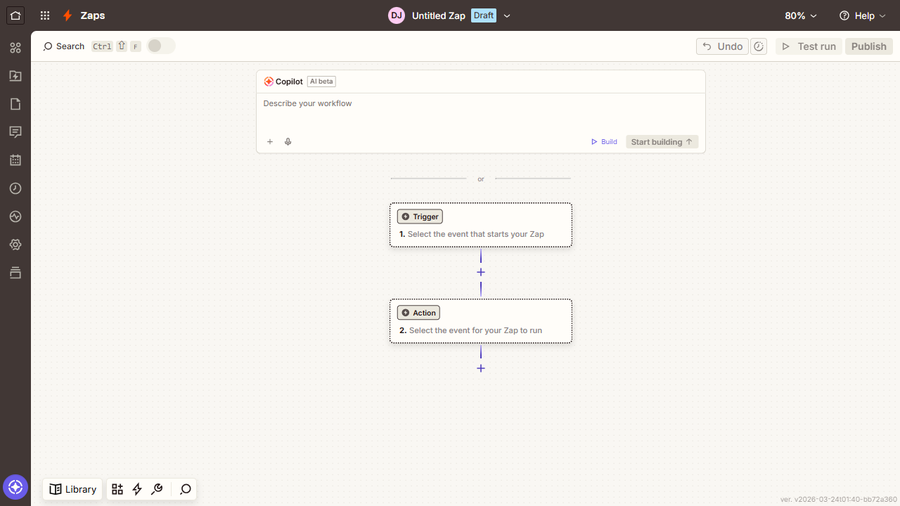
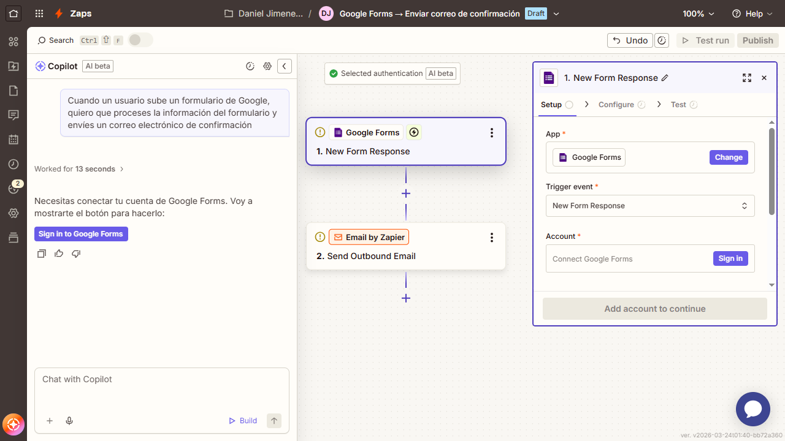
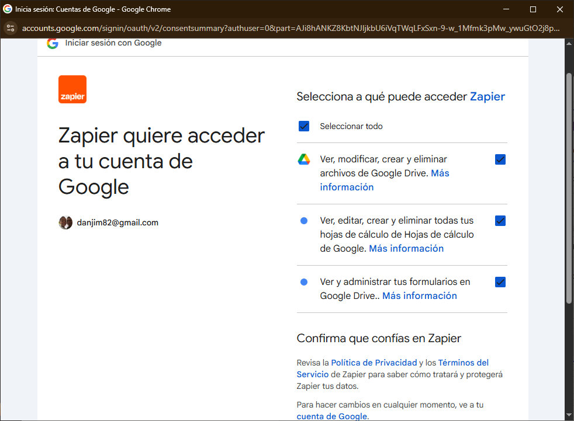
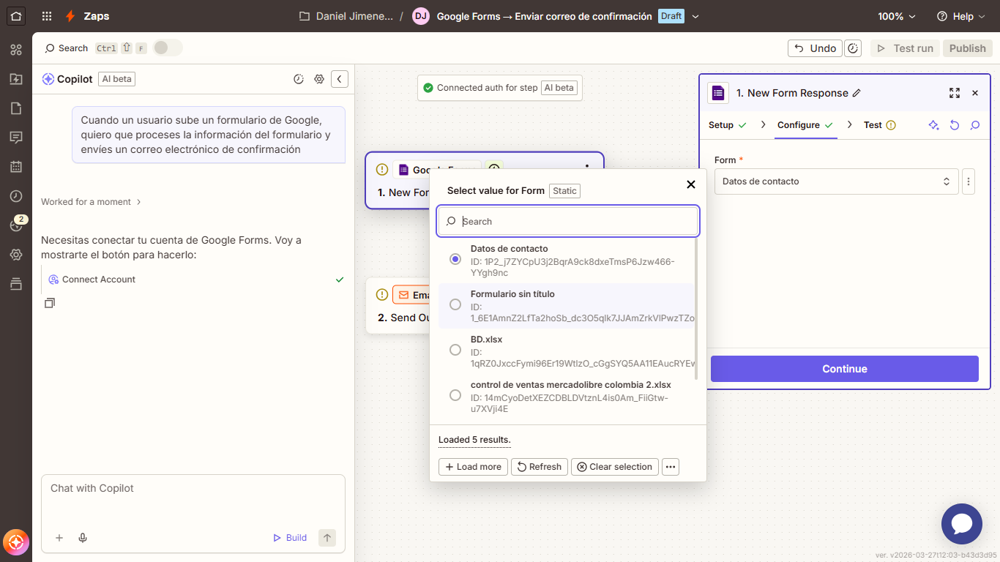
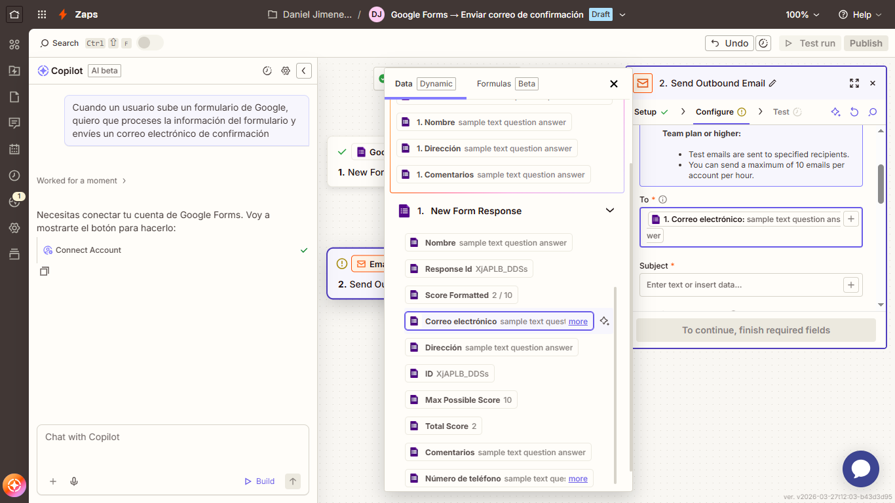
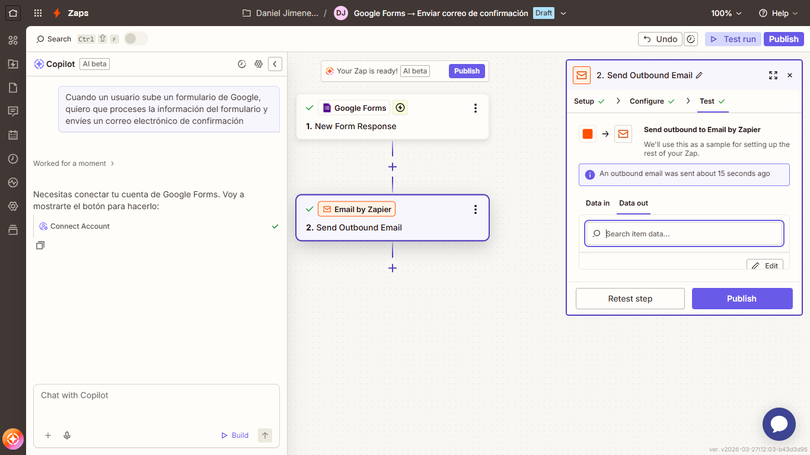

# Primer ejercicio

Para este ejercicio, se conectará Zapier a un formulario de Google Drive.

1. Desde la cuenta con la que se realizó el registro en Zapier, se accede a Google Drive y se selecciona Nuevo -> Formularios de Google -> De una plantilla -> Datos de contacto.

2. En la pestaña de Zapier, se hace clic en el botón Create -> Zaps.

3. En esta pantalla se puede crear el flujo de automatización de forma manual o proporcionar un prompt a la IA de Zapier para que lo genere automáticamente. Para este ejercicio se utilizará la segunda opción. El prompt es: "Cuando un usuario sube un formulario de Google, quiero que proceses la información del formulario y envíes un correo electrónico de confirmación".

Como se puede apreciar en la imagen, Zapier sugiere un flujo basado en las instrucciones dadas. Por lo tanto, se procederá en el siguiente paso a configurar el mismo.

4. Se configura el disparador; en este caso Zapier ya ha establecido la aplicación a usar (Google Forms) y el evento disparador, que ocurre cuando se recibe un nuevo formulario (igualmente se presenta una serie de eventos a seleccionar). En "Account" se debe vincular la cuenta que tiene el formulario creado y asignarle los permisos pertinentes como se ve a continuación.

Luego se presiona el botón de continuar y en el campo "Form" se selecciona el documento con el cual se trabajará.

Posteriormente se procede a realizar un test y, si todo es correcto, se visualizará una marca de verificación en este paso.

5. Luego de configurar el disparador, se continuará con la configuración de la(s) tarea(s).

En este caso se requiere enviar un correo electrónico a la dirección colocada en el formulario. Zapier permite recuperar esos campos utilizando el carácter `/`; esto desplegará la lista de campos del formulario y otras opciones, pero para este caso se utilizará `Correo electrónico`.

Se continúa completando el título ("Subject") y el cuerpo del mensaje ("Body"). Para este caso en específico se mantendrán las demás opciones predefinidas y se procederá a probar ("Test") que todo esté correcto presionando el botón "Continue" y luego "Test step". Al igual que en el paso anterior, si es correcto, aparecerá una marca de verificación.

6. Publicar el Zap: en este paso solo se debe presionar el botón publicar.

Finalmente, el Zap estará en funcionamiento. Para probarlo se puede completar el formulario; se recomienda hacerlo con un correo electrónico distinto al asociado a la cuenta de Zap.
